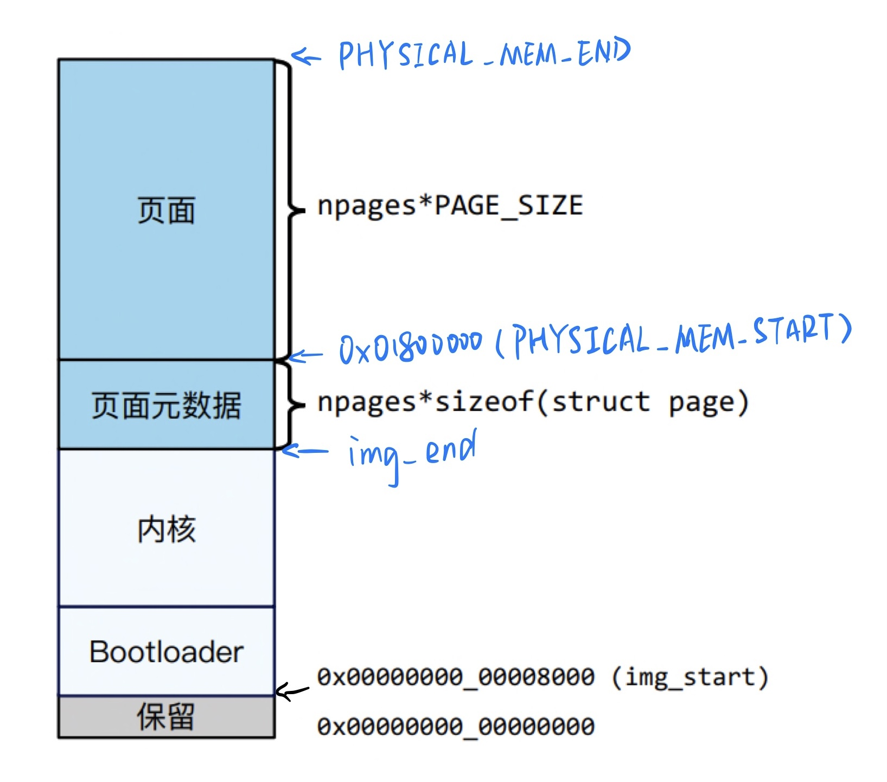

#lab2

### 问题1：请简单解释，在哪个文件或代码段中指定了 ChCore 物理内存布局。你可以从两个方面回答这个问题: 编译阶段和运行时阶段。
+ 编译阶段：boot/mmu.c中init_boot_pt函数
+ 运行时阶段
```c++
kernel/mm.c

extern unsigned long *img_end;
#define PHYSICAL_MEM_START (24*1024*1024)	//24M
#define START_VADDR phys_to_virt(PHYSICAL_MEM_START)	//24M
#define NPAGES (128*1000)
#define PHYSICAL_MEM_END (PHYSICAL_MEM_START+NPAGES*BUDDY_PAGE_SIZE)
```


