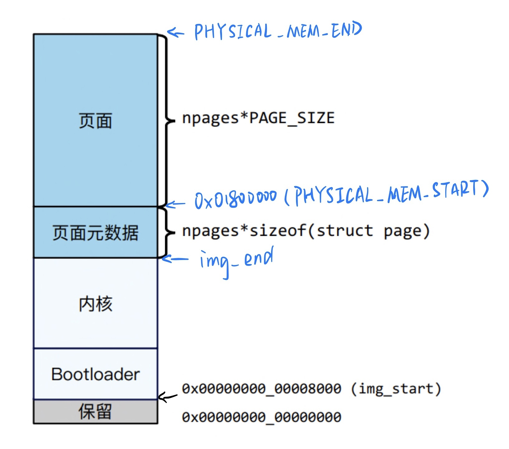

#lab2

## <font color="red">part 1 物理内存管理</font>

### 问题1：请简单解释，在哪个文件或代码段中指定了 ChCore 物理内存布局。你可以从两个方面回答这个问题: 编译阶段和运行时阶段。
+ 编译阶段：boot/mmu.c中init_boot_pt函数
+ 运行时阶段
```c++
kernel/mm.c

extern unsigned long *img_end;
#define PHYSICAL_MEM_START (24*1024*1024)	//24M
#define START_VADDR phys_to_virt(PHYSICAL_MEM_START)	//24M
#define NPAGES (128*1000)
#define PHYSICAL_MEM_END (PHYSICAL_MEM_START+NPAGES*BUDDY_PAGE_SIZE)
```


### 练习1：实现kernel/mm/buddy.c中的四个函数：buddy_get_pages()，split_page()，buddy_free_pages()，merge_page()
&emsp;&emsp;见代码

---

## <font color="red">part 2 物理内存管理</font>

### 问题2：AArch64采用了两个页表基地址寄存器，相较于x86-64架构中只有一个页表基地址寄存器，这样的好处是什么？请从性能与安全两个角度做简要的回答。
+ 性能：在AArch64体系结构上，通常应用程序和操作系统使用不同的页表，由于硬件提供了TTBR0_EL1和TTBL1_EL1两个不同的页表基地址寄存器可供他们分别使用，在系统调用过程中不需要切换页表，避免了切换页表和TLB刷新的开销。
+ 安全：提供了应用程序与操作系统之间的隔离，确保应用程序不会访问操作系统的内存

### 问题3：
1. 请问在页表条目中填写的下一级页表的地址是物理地址还是虚拟地址?
    + 物理地址
2. 在 ChCore 中检索当前页表条目的时候，使用的页表基地址是虚拟地址还是物理地址？
    + 物理地址

### 问题4：
1. 如果我们有4G物理内存，管理内存需要多少空间开销? 这个开销是如何降低的?
    + 页的大小为4K，页表项的大小为8byte，则4G物理内存最多需要4G/4K*8byte=8M空间开销
    + 使用多级页表，可以在虚拟地址空间未被全部使用的情况下减少页表页的个数，从而降低空间开销
2. 总结一下x86-64和AArch64地址翻译机制的区别，AArch64 MMU架构设计的优点是什么?
    + AArch64采用了两个页表基地址寄存器，x86-64架构中只有一个页表基地址寄存器。这样在性能和安全角度都提供了较高的保证
    + AArch64允许页表页L1、L2的pte直接指向block，这样在访问大量连续的内存时可以减少换页的开销

### 练习2：在文件kernel/mm/page_table中，实现map_range_in_pgtbl()，unmap_range_in_pgtbl()和query_in_pgtbl() 
&emsp;&emsp;见代码

---

## <font color="red">part 3 内核地址空间</font>

### 问题5：在AArch64 MMU架构中，使用了两个TTBR寄存器，ChCore使用一个TTBR寄存器映射内核地址空间，另一个寄存器映射用户态的地址空间，那么是否还需要通过设置页表位的属性来隔离内核态和用户态的地址空间?
&emsp;&emsp;不需要，因为两个TTBR寄存器可以为用户态和内核态提供地址空间上的隔离 

### 问题6：
1. ChCore为什么要使用块条目组织内核内存? 哪些虚拟地址空间在Boot阶段必须映射，哪些虚拟地址空间可以在内核启动后延迟?
    + ChCore使用块条目组织内核内存的好处在于允许huge page的存在，这样当需要对应大块连续的物理地址的时候，可以减少换页的开销
    + TTBR0_EL1和TTBR1_EL1中为设备空间的虚拟地址空间必须在boot阶段映射，其他可以在内核启动后映射
2. 为什么用户程序不能读写内核内存? 保护内核内存的具体机制是什么?
    + 因为需要防止用户程序改变内核程序的逻辑，造成崩溃以及安全隐患，如用户数据覆盖内核数据、恶意的用户态进程修改内核数据等
    + 具体机制有页表中的权限位来保证用户代码只访问用户态地址空间，或使用两个TTBR寄存器，一个映射内核地址空间，另一个映射用户态地址空间

### 练习3：完善kernel/mm/mm.c中的map_kernel_space()函数，实现对内核空间的映射，并且可以通过kernel_space_check()的检查。 
&emsp;&emsp;见代码